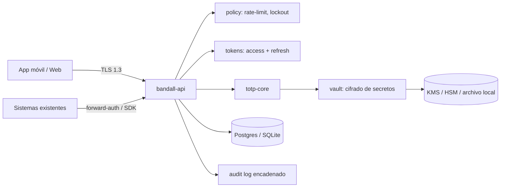

# BandAll — Blueprint de arquitectura
*Servicio de seguridad TOTP en Rust. Alcance: diseño de ingeniería, repo y hoja de ruta (sin código). Documentos hermanos: `BANDALL_ROADMAP.md` (guía paso a paso) y `AGENTS.md` (reglas).*

## 1. Principios y alcance honesto

1. **El código nunca viaja.** Cliente y servidor comparten un secreto y derivan el mismo OTP de `secreto + ventana de tiempo` (RFC 6238 / RFC 4226).
2. **Un núcleo, tres formas de uso** (ver §2). Lo que se prueba una vez sirve en todas.
3. **Simple por diseño:** 1 binario, 1 archivo de configuración, Postgres (o SQLite). Sin colas ni brokers en el MVP.
4. **Seguro por defecto:** `#![forbid(unsafe_code)]`, comparación en tiempo constante, secretos con `zeroize`, nada sensible en logs.
5. **Honestidad:** no existe "grado militar" certificable. El objetivo medible es: **OWASP ASVS L3**, **NIST SP 800-63B AAL2**, cripto con opción **FIPS** (`aws-lc-rs`), y pruebas externas (pentest). Ojo: **TOTP es phishable**; para resistencia real al phishing, el diseño reserva un segundo tipo de factor (**WebAuthn/passkeys**, fase 9).

## 2. Modos de despliegue

| Modo | Uso | Cómo |
|---|---|---|
| **A. Servicio independiente** | Auth/MFA central para apps web y móviles | API HTTP + JWKS |
| **B. Sidecar / forward-auth** | Proteger sistemas existentes sin tocarlos | Endpoint compatible con nginx `auth_request`, Envoy `ext_authz`, Traefik |
| **C. Librería embebida** | Sistemas cerrados u offline/air-gapped | Crates `bandall-totp-core` + `bandall-store` (SQLite), sin red |

## 3. Arquitectura



**Camino crítico de verificación (hot path):** 1 lectura + 1 `UPDATE` condicional + HMAC (microsegundos). Es *stateless*: escala horizontalmente; el cuello de botella real es la base de datos, no Rust.

## 4. Estructura del repositorio

```
bandall/
├─ Cargo.toml                # workspace
├─ deny.toml  rust-toolchain.toml  .github/workflows/
├─ crates/
│  ├─ totp-core/             # HOTP/TOTP, base32, otpauth://  (puro, sin IO)
│  ├─ vault/                 # cifrado envolvente, trait KmsProvider
│  ├─ tokens/                # access (PASETO/JWT EdDSA), refresh, JWKS
│  ├─ policy/                # rate limit, lockout, antirreplay
│  ├─ store/                 # trait + impl postgres + impl sqlite, migraciones
│  ├─ sigs/                  # firmas HMAC de requests/webhooks
│  ├─ api/                   # axum: rutas, middleware, OpenAPI
│  ├─ sdk-axum/              # Layer/guard para verificar tokens offline
│  ├─ authenticator-core/    # lógica del cliente (UniFFI → Swift/Kotlin)
│  └─ cli/                   # init, rotate-keys, migrate, export-audit
├─ sdks/ (ts, python, go, csharp)   # finos: verifican JWT vía JWKS
├─ tests/ (integration, e2e, load)  fuzz/  docs/  openapi.yaml
└─ deploy/ (Dockerfile distroless, helm, compose)
```
Convención: el directorio `crates/api` es el paquete `bandall-api` (todos llevan prefijo `bandall-`); el binario se llama `bandall`.
Regla: `totp-core` no depende de nada de red/DB → fácil de auditar y de fuzzear.

## 5. Núcleo TOTP — decisiones

- **Algoritmo:** HMAC-SHA-1 solo por compatibilidad (Google/Microsoft Authenticator ignoran el parámetro `algorithm`). Con **tu propia app**, usa **SHA-256** por defecto. Configurable por factor.
- **Parámetros:** 6 dígitos, periodo 30 s, secreto **160 bits (SHA-1) / 256 bits (SHA-256)** desde el CSPRNG del SO (`getrandom`).
- **Truncamiento dinámico** (RFC 4226) y `mod 10^6`; se compara con `subtle::ConstantTimeEq`.
- **Ventana de tolerancia:** ±1 paso (3 códigos válidos). El servidor aprende la deriva por factor (`drift_steps`, acotada) para usuarios con reloj desfasado.
- **Antirreplay (clave):** guardar `last_step` y aceptar solo si `step > last_step` con `UPDATE ... WHERE last_step < $step` (atómico). Un código sirve **una sola vez**.
- **Pruebas obligatorias:** vectores oficiales del RFC 6238 (SHA-1/256/512), `proptest`, `cargo-fuzz` sobre parsers.
- **Fuerza bruta:** 3 aciertos posibles de 10⁶ por intento → el límite de intentos *es* la defensa (§9), no el tamaño del código.

## 6. Bóveda de secretos

El servidor **necesita el secreto en claro** para calcular HMAC, así que no se puede hashear: se **cifra**.
- **Cifrado envolvente:** KEK en KMS/HSM (Azure Key Vault, AWS KMS, PKCS#11 o archivo local protegido en modo offline) → DEK → AEAD (XChaCha20-Poly1305 o AES-256-GCM).
- **AAD** = `tenant_id | subject_id | factor_id`: el ciphertext queda atado a su fila (no se puede copiar entre usuarios).
- Rotación: cada fila guarda `kek_id`; un job re-envuelve sin downtime.
- En memoria: `secrecy` + `zeroize`; desactivar core dumps; secreto mostrado **una sola vez** (QR) y nunca reexpuesto.
- **Códigos de recuperación:** 10 códigos de alta entropía, guardados con **Argon2id**, de un solo uso.

## 7. Flujos

**Enrolamiento:** `start` (genera secreto, estado `pending`, devuelve URI `otpauth://` para el QR) → usuario escanea → `confirm` con el primer código → `active` + códigos de recuperación. Un factor `pending` expira en 10 min.
**Login (paso 2):** credencial primaria válida (la tuya o de un IdP) → *challenge* de corta vida → el usuario envía OTP → `verify` → emite tokens con `amr: ["pwd","otp"]`.
**Verificación S2S:** un sistema existente llama `POST /v1/verify` autenticado con mTLS/API key firmada.
**Recuperación:** código de recuperación → re-enrolar; todo evento queda en auditoría y notifica al usuario.

## 8. Tokens y sesiones

- **Access token:** PASETO v4.public o JWT con **EdDSA (Ed25519)**, vida **5–10 min**, claims `sub, tenant, sid, amr, aal, jti, exp`. Los servicios lo validan **offline** con JWKS en caché → cero latencia extra.
- **Refresh token:** opaco de 256 bits, guardado como hash, **rotación en cada uso** y **detección de reutilización** (si reaparece uno viejo, se revoca toda la familia).
- **Web:** cookies `__Host-`, `HttpOnly`, `Secure`, `SameSite=Strict` + CSRF. **Móvil:** Keystore/Keychain. Opcional: tokens **ligados al dispositivo** (DPoP, RFC 9449).
- Rotación de claves de firma con `kid` y solapamiento; revocación por `sid` (lista corta en memoria/DB).

## 9. Defensa activa (policy)

Límite por factor (p. ej. 5 fallos → backoff exponencial → bloqueo temporal), por IP y por tenant. Respuestas **idénticas** ante usuario inexistente o código erróneo (anti-enumeración). Alertas por ráfagas de fallos.

## 10. Firmas HMAC para APIs y webhooks (el patrón del final de tu texto)

- Cadena canónica: `METHOD \n PATH \n QUERY \n SHA256(body) \n timestamp \n nonce`.
- Cabecera `X-Signature: v1=<hmac>` + `X-Key-Id` (dos claves activas para rotar sin corte).
- Validación: tolerancia de reloj ±5 min, **nonce de un solo uso** (caché con TTL), comparación en tiempo constante.
- Sirve para **contratos de API**: cada cliente recibe un `key_id` con *scopes* declarados en el `openapi.yaml`.

## 11. API (v1)

| Ruta | Propósito |
|---|---|
| `POST /v1/factors/enroll/start` · `/confirm` | Alta del factor |
| `POST /v1/mfa/verify` | Verificar OTP / recovery (login) |
| `POST /v1/verify` | Verificación S2S |
| `GET /v1/authz/check` | Forward-auth (200/401 + cabeceras) |
| `POST /v1/token/refresh` · `/revoke` | Ciclo de tokens |
| `GET /.well-known/jwks.json` | Claves públicas |
| `POST /v1/sigs/verify` | Validar firmas HMAC |
| `GET /healthz` `/readyz` `/metrics` | Operación |

Versionado de rutas, errores RFC 7807, idempotency-key en escrituras, OpenAPI generado (`utoipa`).

## 12. Modelo de datos (mínimo)

`tenants` · `subjects` · `factors(secret_ct, nonce, kek_id, algo, digits, period, last_step, drift_steps, status)` · `recovery_codes(hash, used_at)` · `sessions/refresh_families(hash, family_id, revoked_at)` · `api_clients(key_id, key_ct, scopes)` · `audit_log(prev_hash, hash, event, ts)` — **log append-only encadenado por hash** (detecta manipulación).

## 13. Modelo de amenazas

| Amenaza | Mitigación |
|---|---|
| Robo de la base de datos | Secretos cifrados con KEK fuera de la DB + AAD |
| Replay de OTP | `last_step` atómico |
| Fuerza bruta | Lockout + backoff + rate limit |
| Phishing en tiempo real | Límite de TOTP; añadir WebAuthn (fase 9) |
| Robo de refresh token | Rotación + reuse detection + device binding |
| Deriva de reloj | Ventana ±1 + `drift_steps` |
| Insider / admin | Auditoría encadenada, separación de roles, acceso a KMS auditado |
| Cadena de suministro | `cargo-deny/audit/vet`, builds reproducibles, SBOM, firmas |
| DoS | Límites de body/timeouts, rate limit, `tower` load-shed |

## 14. App autenticadora (cliente offline)

Secreto en **Secure Enclave / Android Keystore** (StrongBox si existe), acceso protegido por biometría local, `FLAG_SECURE` (sin capturas), cuenta regresiva visible, aviso si el reloj del dispositivo se desvía mucho. Lógica compartida en `authenticator-core` (Rust → UniFFI para Swift/Kotlin). Backup cifrado opcional con passphrase (Argon2id); por defecto, **sin backup en la nube**.

## 15. Escalabilidad y operación

Réplicas *stateless* detrás de un balanceador; Postgres con réplica de lectura (las escrituras son solo `last_step`, intentos y auditoría). Rate limit local con `governor`; Redis solo si necesitas límites globales precisos. Observabilidad: `tracing` + OpenTelemetry, métricas Prometheus, **sin secretos en logs**. Imagen *distroless*, usuario no root, FS de solo lectura. Metas a validar con benchmark (no asumir): p99 de `verify` interno < 5 ms; pruebas de carga con `k6`/`oha`.

## 16. Hoja de ruta (estimación orientativa, 1 desarrollador)

| Fase | Entregable | "Hecho" cuando… |
|---|---|---|
| **0. Cimientos** (1 sem) | Workspace, CI, lints, `cargo-deny`, ADRs | CI verde, `forbid(unsafe)` |
| **1. `totp-core`** (1–2 sem) | HOTP/TOTP, base32, otpauth | Pasa vectores RFC + fuzz |
| **2. Vault + store** (2 sem) | Cifrado envolvente, migraciones, SQLite/Postgres | Rotación de KEK probada |
| **3. API enrolar/verificar** (2 sem) | Flujos §7, antirreplay | Replay y fuerza bruta bloqueados en tests |
| **4. Tokens y sesiones** (2 sem) | Access/refresh, JWKS, revocación | Reuse detection probada |
| **5. Hardening** (2 sem) | Policy, auditoría encadenada, anti-enumeración | Revisión de amenazas §13 cerrada |
| **6. Integración** (2–3 sem) | Forward-auth, `sdk-axum`, SDKs, firmas HMAC | Protege una app legacy sin modificarla |
| **7. App autenticadora** (3–4 sem) | `authenticator-core` + UI móvil | Funciona en modo avión |
| **8. Operación y escala** (2 sem) | Helm, métricas, carga, DR/backups | Pruebas de carga y *chaos* superadas |
| **9. Certificación** (continuo) | Pentest externo, WebAuthn, FIPS opcional | Hallazgos críticos = 0 |

**Orden de MVP útil:** fases 0 → 4 ya dan un servicio funcional; 5 es obligatoria antes de producción.

## 17. Qué NO hacer

No inventar criptografía propia · no guardar secretos en claro ni en logs · no enviar el OTP por SMS como único respaldo · no omitir el antirreplay · no desplegar sin pentest · no añadir microservicios extra hasta que la carga lo exija.
